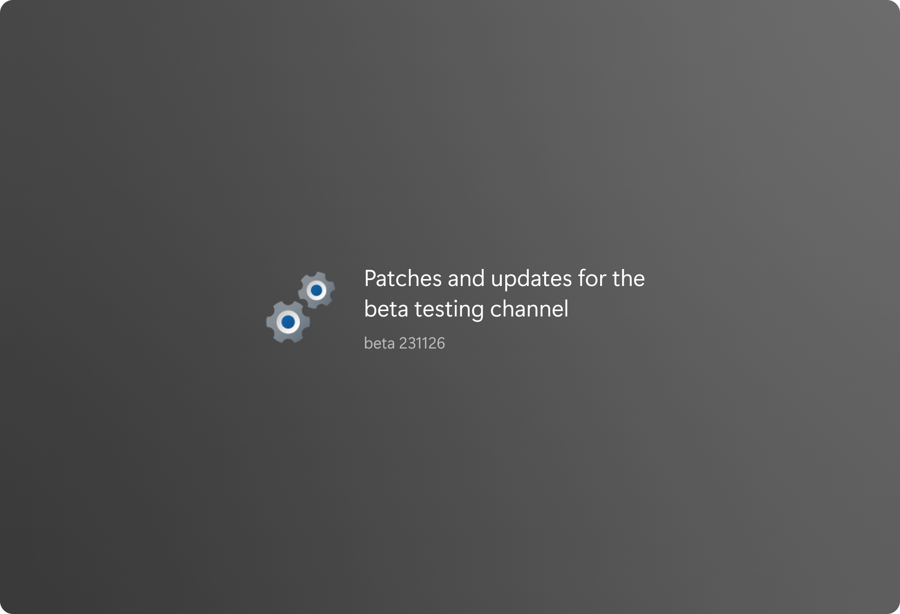

# Rollout of patches and fixes for version 1.4 🔧⚙️
*beta_build 231126 (**Cumulative update**)*

In this update, the ChatGPT module for the AI assistant has been fixed, addressing any issues. The release includes stability and productivity improvements, along with important security updates for an enhanced user experience.

## Assistant productivity improvements

• Through extensive optimization in the latest update, the assistant's responses have been significantly enhanced, allowing for faster and more prompt answers to your queries.

## Use without logging In

• In this latest update, you can now use the app without the necessity of logging in with your Microsoft account, providing a more accessible and user-friendly experience.

## AI answers in the search feed

• **[Premium feature]** In this update, a new feature has been introduced: AI answers in the search feed. Now, the search feed includes responses generated by the AI assistant, enhancing the depth and richness of information provided.

## Sync settings page was updated

• Discover a more intuitive and personalized synchronization experience with our revamped Sync Settings page. Now featuring an enhanced design, effortless customization, and real-time status updates, managing your synchronization preferences has never been easier. 

## Bug fixes

• The bugs related to refreshing widgets feed in the News & Explore section have been successfully addressed and resolved in this update.

• Recent history experience on the home page was optimized and fixed.

• The bugs related to the OpenAI GPT module for the assistant have been successfully identified and resolved in this update.