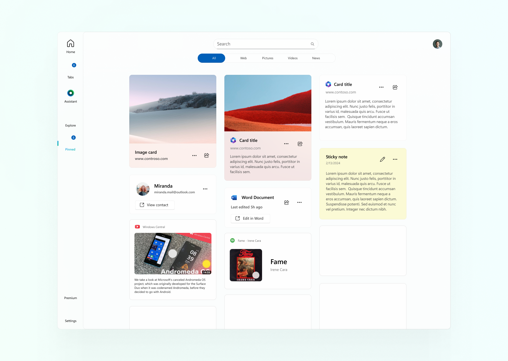

# What's new in 231224 build? ✨

The culmination of 2023, Build 231224, marks the final release for the year. This pivotal version sets the stage for the upcoming iteration of the application, unveiling an exciting roadmap for 2024. Anticipate the integration of a sophisticated built-in browser, bolstered by enhanced support for search extensions. Additionally, the roadmap outlines the inception of a mobile application rooted in .NET MAUI, accompanied by a host of innovative search and AI features that promise to redefine user experience.

## Redesigned pinned content view and UI experience

• Experience a stunning design showcasing your pinned websites, pictures, videos, and other items in a beautiful layout. With the ability to pin anything from anywhere, organizing your favorites has never been easier. Plus, enjoy the added sorting feature, allowing you to manage and seamlessly switch between items in the list. We've also resolved numerous bugs to enhance your pinned content experience.

## Some improvements on news & explore view page

• Switching between sections and content now uses a modern Segmented control that fits perfectly with the overall Fluent design system.

• Work has been carried out in the area of optimizing content loading, switching between sections and content, and correcting errors.

• Files & folders widget was redesigned for better user experience. Now you has fast access to libraries and pinned files and folders from your device and OneDrive.

• The issue with dynamic backgrounds in the weather widget has been resolved.

## OOBE search setup page

• In this update, we've included a new step in the app's initial setup experience: the Search Settings Page. Now, users can easily configure their search preferences right from the start, ensuring a personalized and tailored search experience from the get-go.

## Search privacy settings

• Exciting News: In this latest update, we're rolling out our Search Privacy Settings Policies, providing users with enhanced control over their privacy and security preferences. With three distinct modes - Basic, Balanced, and Strict - users can tailor their search experience to their desired level of privacy.

- <b>Basic Mode</b>: This mode offers a streamlined and minimalistic approach to privacy, prioritizing simplicity and ease of use. Users can enjoy a hassle-free browsing experience while still benefiting from basic security measures.

- <b>Balanced Mode</b>: Perfect for those seeking a middle ground between privacy and convenience, Balanced Mode provides users with enhanced privacy protections without sacrificing usability. This mode strikes a balance between security and accessibility, ensuring a safe and enjoyable browsing experience.

- <b>Strict Mode</b>: Designed for users who prioritize maximum privacy and security, Strict Mode offers comprehensive protections against potential threats. With advanced security algorithms and strict privacy controls, users can browse with confidence, knowing that their online activities are shielded from harm.

Furthermore, we've implemented sophisticated security algorithms designed to detect and block potentially unsafe websites and services, bolstering overall security measures. This proactive approach ensures that users can browse with confidence, knowing that their online interactions are safeguarded against potential threats. Stay protected and enjoy peace of mind with our latest privacy enhancements.

## New features in AI assistant and bug fixes

• Starting now, the assistant will no longer interpret or vocalize links and code blocks using voice. 

• Beginning with this update, users now have the capability to cancel assistant requests. This new feature empowers users with greater control and flexibility, allowing them to halt ongoing interactions with the assistant as needed.

• In this update, the interface for interacting with the assistant has undergone significant enhancements, including the introduction of a chat history feature and improved management of chat and correspondence contexts. Additionally, various other changes and interface improvements have been implemented for an even more seamless user experience.

## Redesigned now network UI

• No Network UI has been enhanced to detect network changes in real-time. This means that users can seamlessly transition between network states, with the UI dynamically adjusting to provide uninterrupted access to local data for search purposes. Whether you're online or offline, you can now rely on our UI to seamlessly adapt to your network environment, ensuring a smooth and uninterrupted search experience

## Other search improvements

• A fast button support for GitHub has been added to the informational card.

• A quick access button support for Stack Overflow has been added to the informational card.

• The Search UI design has been elevated to new heights, embracing the latest Fluent Design guidelines for a polished and modernized user experience.

## Bug fixes

• The informational cards within the search feed have undergone a design enhancement in the latest update. Users can now enjoy an improved visual experience, thanks to the refined design elements. Additionally, any existing bugs related to the display of information on these cards have been diligently addressed and fixed. This update aims to provide a more polished and seamless user interface in the search feed.

• The bugs on the news & explore page have been fixed.

• Microsoft account data now loads faster, and the sign-in algorithm has been optimized for improved efficiency.